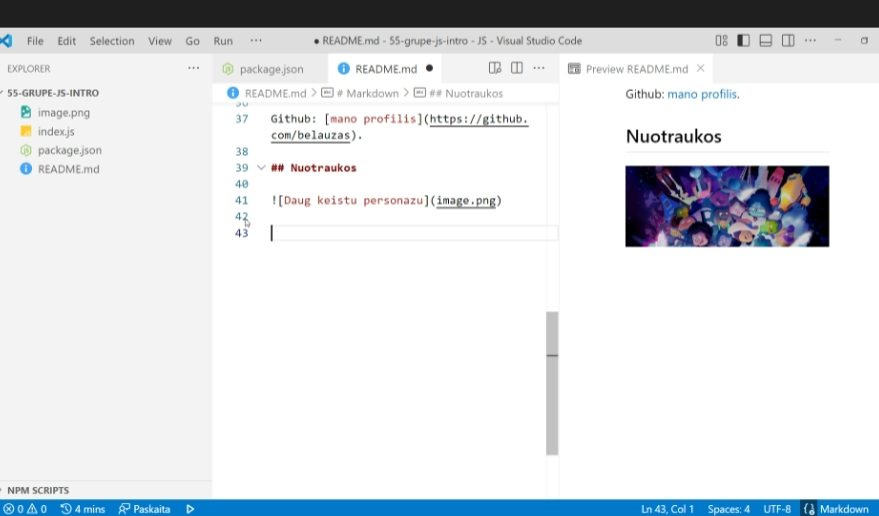

# Markdown

Failo pletinys: .md
## Sarasas

daiktai: 

-   pomidoras
    -   pomidoras
    -   agurkas
        -   pomidoras
        -   agurkas
        -   bulve
    -   bulve
-   agurkas
-   bulve        

## Bold ir Italic
Labas rytas Lietuva!
**Labas** rytas Lietuva
Labas _rytas_, Lietuva!
Labas rytas, _**Lietuva**_!
**Labas rytas, Lietuva!**
_Labas rytas, Lietuva!_
_**Labas rytas, Lietuva!**_

 ## Nuoroda
 Github: [mano profilis](https://github.com/GreenAlien90)

## Nuotrauka 
 

